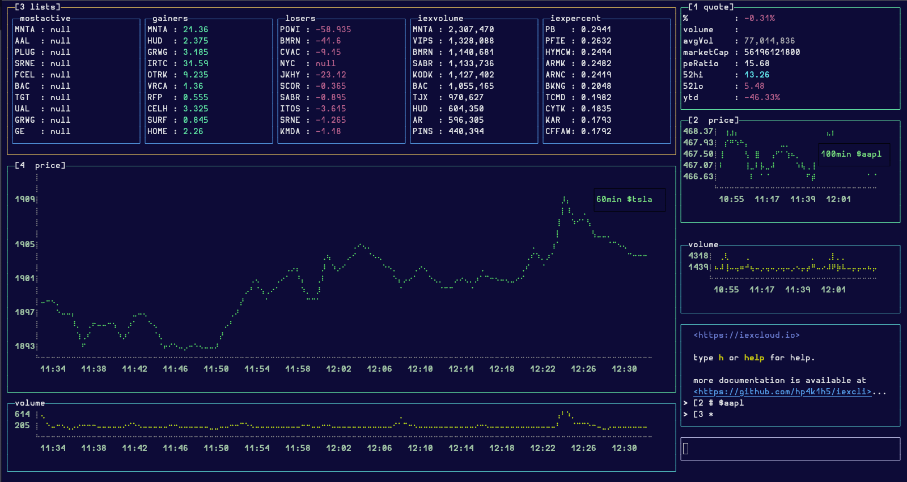
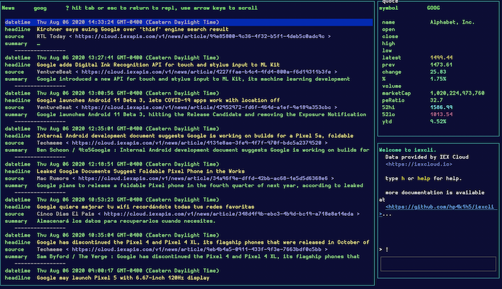
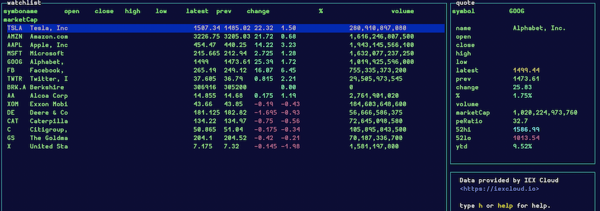

# iexcli

> query and view stock charts in the terminal using a
> [blessed](https://github.com/chjj/blessed) interface and
> [blessed-contrib](https://github.com/yaronn/blessed-contrib) widgets

#### !!warning unstable and in early development ⚠
[contributions](./.github/CONTRIBUTING.md) and [bug
reports](https://github.com/HP4k1h5/iexcli/issues/new?assignees=HP4k1h5&labels=bug&template=bug_report.md&title=basic)
are_welcome_


##### Terms of Service for IEX data
[Data provided by IEX Cloud](https://iexcloud.io)

- [CHANGELOG](#changelog)
- [installation](#installation)
- [usage](#usage)
  - [commands](#commands)


## CHANGELOG
## v0.0.7
- bin fix, `iexcli` alias should work again.

### v0.0.6
- 💠 multi-component handling. user can specify as many component windows as
    they wish for any component except repl. See [usage](./README.md#usage)
- 🎠 carousel mode. Use left and right arrows to switch workspaces.
- 📜 gainers/losers lists. use `*` command to see list info

### v0.0.3
- 🔍 fuzzy search for symbols by symbol or company name. thanks to farzher's
   [fuzzysort](https://github.com/farzher/fuzzysort), users can now use `?`
  command to print possible matches for their search terms. see [](#fuzzysort)
- 💻 new shell alias `iexcli` should run from anywhere, if you have iexcli
     installed globally.

## installation

### requirements
- [nodeJs](https://nodeJs.org) ✅ tested with `v14.8.0`

1) download or clone this repo
    1) either `git clone https://github.com/HP4k1h5/iexcli.git` and get
      dependencies by running `yarn` in this directory
    2) or run `yarn global add @hp4k1h5/iexcli`  OR  `npm i -g @hp4k1h5/iexcli`

2) add a **publishable** iex api key
    1) either export an ENV var named [IEX_PUB_KEY](#register)  
    ex. `export IEX_PUB_KEY=pk_Y0urIeXaPipUbl15h4bLeKEY` locally or in your
    `.bashrc` equivalent.
    2) or set the `IEX_PUB_KEY` in `config.json` in this repo, or the default
    config location, on a mac, this will be `~/.config/iexcli/config.json`.
    *You will have to create the directory with e.g.* `mkdir
    ~/.config/iexcli`, and then copy over your config with e.g. on a mac
    ```bash
    cp  ~/.config/yarn/global/node_modules/@hp4k1h5/iexcli/config.json ~/.config/iexcli
    ```
    You can copy the default config from this repo

#### register
**for a free [iex account](https://iexcloud.io/cloud-login#/register)** and
copy the **publishable** api key. These typically start with `pk`


## usage

### getting started

If you installed globally, you should be able to use the bash alias `iexcli`
from anywhere. Be sure to refresh your terminal, e.g. `exec zsh` or start a
new terminal window after installing so that the alias can be found. If you
still cannot find an alias, try running `yarn link` from this project
directory root. Otherwise, if you downloaded with git or to a local directory,
RUN `node src/index.js` from the root of this directory, or `yarn run run`.

Most interaction is through the repl emulator screen. It accepts commands and
updates the charts and data windows. If a component has more data than fits on
the screen, try scrolling it with the mouse.

Type `help` or `h` for general information. Type e.g. `h $` or `h :` for
command-specific help. If your terminal allows it, you can scroll through the
help.

### focus and windows

Use `tab` and `Shift-tab` to rotate through components. To return directly to
repl hit `>`, the "greater-than" sign. The last focused component will be the
one targeted by the command. When you start typing in the repl, the last
focused component should be highlighted with a yellow border.

Type `esc` from the repl to re-enter the focus-rotation. It can be confusing
and if you return directly to the repl when you expected to rotate, try going
in the other direction, i.e. `Shift-tab` instead of `tab` or vice-versa.

Every targetable window in iexcli should have a number in the top-left corner
of the screen. From the repl you can type a `[` window prefix to target a
specific window with a command. For instance, in this example:



the command `[3 $aapl !` would switch the 2 window to a news view of appl.


### commands

#### `help` or `h`
Typing `help` or `h` brings up a help menu. If you include another command
name after, command-specific help is returned.  
**examples**
```bash
help $   # show help for stock prefix command
h :      # show help for time prefix command
h        # show general help
```

#### `quit` or `exit`
Typing `quit` or `exit` will exit the app

#### `[` window id prefix
Typing a `[` followed immediately by a window id, will target the window with
the command. Window ids are found in the top-left corner of each targetable
window.  
examples  
```bash
[4 # :1y $tm
```
this will display a 1-year chart of $tm in the fourth window
```bash
& $pg [2
```
this will display a company profile of $pg in the second window

#### `?` search
Typing `?` followed by search terms will query stock symbols and company names
for approximate (fuzzy) matches. Capitalization and spacing is ignored as are
quotes and most other non word symbols.
If you are searching by key word like "solar", consider adding more words to
narrow down the result set  
examples  
```bash
? electric
   tlsa    ?  
?   "american Motor" company
```

#### `$` stock ticker symbol prefix
Typing `$` followed immediately by a stock ticker symbol changes the currently
active symbol, updating all visible charts and data windows. Can be combined
with time prefix to update multiple values at the same time  
**examples**
```bash
$tsla          # update active symbol to TSLA
$BRK.B :1.5h   # update active symbol to BRK.B and update time to last 90 minutes
```

#### `:` time range prefix
Typing `:` followed immediately by a combination of the following paramters
will change the currently active time range and update all visible charts and
data windows.  
**valid times ranges** `5d, 1m, 3m, 6m, ytd, 1y, 5y, max`  OR  
numeric values affixed with `min` or `h`, see examples.  
Can be combined with time prefix to update multiple values at the same time  
**examples**
```bash
:100min        # update time to last 100 minutes
:6.5h          # update time to last trading day
:5d  $x        # update time to last 5 days and update stock to X
```

#### `!` news command
Typing `!` brings up the news display with the latest 20 results relevant to
the active symbol. Use arrow keys `up` and `down` to navigate the table. Use
`tab` or `esc` to return to repl. Can be combined with stock prefix to update
multiple values at the same time  
  
**examples**
```bash
$de !          # show news and update active stock to DE
! $ibm         # show news and update stock to ibm
```

#### `=` watchlist command
Typing `=` brings up the watchlist display. Use arrow keys `up` and `down` to
navigate the table. Use `tab` or `esc` to return to repl.  
 Key values `open high low
close` are only available to iex premium data subscribers and during
non-market hours to other api consumers.  
**examples**
```bash
=
```

#### `#` chart command
Typing `#` brings up the price/volume chart display.
**examples**
```bash
# :1d $t
```

#### `&` profile command
Typing `&` brings up a profile of the active symbol. Use mouse to scroll
components.
  
**examples**
```bash
$qcom &
```

#### `*` list command
Typing `*` brings up a list of gainers/losers/active/etc. List can be
customized in `config.json`.
**examples**
```bash
*
```
