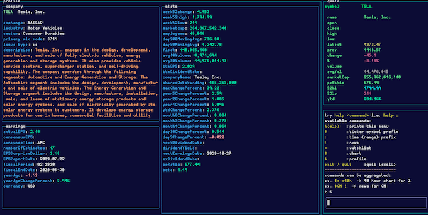
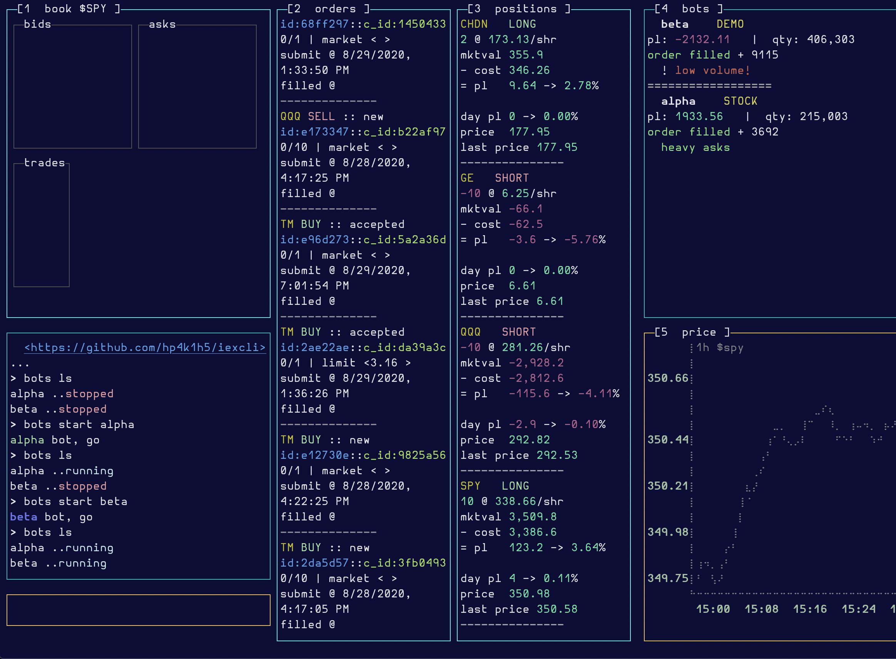

# agora

<span style="display:inline-block; width:50% ">

> view market info and charts and trade stocks in the terminal

</span>

<span style="display:inline-block;top:0;float:right;padding:7px;border:3px #ddd solid">

###### Terms of Service for IEX data

> [Data provided by IEX Cloud](https://iexcloud.io)

</span>

##### !!warning agora is in _alpha_ and subject to change ⚠

[contributions](./.github/CONTRIBUTING.md) and [bug
reports](https://github.com/HP4k1h5/agora/issues/new?assignees=HP4k1h5&labels=bug&template=bug_report.md&title=basic)
are _welcome_


> the workspace used to generate this image is defined in
> [docs/example-configs/dense.json](./docs/example-configs/dense.json)

##### table of contents

- [CHANGELOG](#CHANGELOG)
- **[installation](#installation)**
- **[usage](#usage)**
  - [getting started](#getting-started)
  - [**workspaces**, focus and windows](#workspaces,-focus-and-windows)
  - [**commands**](#commands)
- [🦙 trading](#🦙-alpaca-trading)
  - [**bots**](#bots)
- [**config.json**](#config\.json)
- [thanks!](#thanks)

## CHANGELOG

### v0.1.1
- 📜 scroll back through past commands with <kbd>up</kbd>, up arrow.
- 🗄  logger for bot; read/write bot data. See [bot
  README](docs/bots/README.md)
- 🦙 alpaca account activities tracker. type `activities`
- 🏫 [tutorial](docs/TUTORIAL.md), better docs
- 💹 small chart improvements (see @hp4k1h5/blessed-contrib changes)
 - charts should no longer wrap horizontally with large datasets
 - charts should occupy vertical space better

### v0.1.0
- beta release, more stability and reliability
- 🧮 name change! app was formerly called iexcli, please update your globals
  accordingly. e.g. `yarn global remove @hp4k1h5/iexcli && yarn global add @hp4k1h5/agora` 
- more documentation

---

## installation

### requirements

- [nodeJs](https://nodeJs.org) ✅ tested with `v14.8.0`

1) download or clone this repo
    1) either run `yarn global add @hp4k1h5/agora`  OR  `npm i -g @hp4k1h5/agora`.
    2) or run `git clone https://github.com/HP4k1h5/agora.git` and get
      dependencies by running `yarn` in this directory, or `npm i`.

2) add a **publishable** iex api key
    1) either export an ENV var named [IEX_PUB_KEY](#register)  
    ex. `export IEX_PUB_KEY=pk_Y0urIeXaPipUbl15h4bLeKEY` locally or in your
    `.bashrc` equivalent.
    2) or set the `IEX_PUB_KEY` in `config.json` in this repo, or the default
    config location; on a mac, this will be `~/.config/agora/config.json`.
    *You will have to create the directory with e.g.* `mkdir
    ~/.config/agora`, and then copy over your config with e.g. on a mac
    ```bash
    cp  ~/.config/yarn/global/node_modules/@hp4k1h5/agora/config.json ~/.config/agora
    ```

    **examples**

    in `.bashrc` equivalent or from the command line

    ```bash
    export IEX_PUB_KEY="yourIEXpublishablekey"
    export IEX_SECRET_KEY="yourIEXsecretkey" # optional
    ```

    or in config.json

    ```json
    {
      "IEX_PUB_KEY": "yourIEXpublishablekey",
      "IEX_SECRET_KEY": "yourIEXsecretkey     # optional"
    }
    ```

    See **[config.json](#config\.json)** for configuration tips and example configs.

3) If you installed globally, you should be able to use the shell alias
   `agora` from anywhere. If you encounter problems are want a more
   comprehensive tutorial, please see [tutorial](docs/TUTORIAL.md).

#### optional

- iex account info  
    In order to see iex account information also set the `IEX_SECRET_KEY` in the
    same manner as above. See [account](#@-account).

- <span style="background:#222; color:#ece">🦙 alpaca account integration.</span>  
    See [🦙 trading](#🦙-alpaca-trading).

#### register

**for a free [iex account](https://iexcloud.io/cloud-login#/register)** and
copy the **publishable** api key. These typically start with `pk`

#### note about iex message usage

> if you receive <span style="color:red">"Payment required"</span> error
> messages, this is iexcloud telling you that your remaining message allotment
is insufficient for the data request you are making. You can visit your
[iexcloud console](https://iexcloud.io/console/usage) or type `@` from the repl
for more information. If you wish to make the most use of your 500,000 free
monthly iex messages, avoid longer time-range graph queries. For example,
a 1-year chart costs roughly 12,590 messages (~252 trading days * 50
messages/day). Intraday time ranges such as `:1d` or `:100min` are free, i.e.
incur no message cost. See [iex api
documentation](https://alpaca.markets/docs/api-documentation/) to learn more
about endpoint pricing.

## usage

### getting started

Please consult the [tutorial](docs/TUTORIAL.md#getting-started).

### workspaces and components

Please consult the
[tutorial](docs/TUTORIAL.md#workspaces-and-components).

### commands

#### `help` or `h`

Typing `help` or `h` brings up a help menu. If you include another command
name after, command-specific help is returned to the repl. Type `x` in the
repl to close the help menu  
**examples**
```fortran
help $      --> show help for stock prefix command
h :         --> show help for time prefix command
h #         --> show help for chart command
h           --> show general help
```

#### `quit` or `exit`

Typing `quit`, `exit` or `Ctrl-c` will exit the app

#### <kbd>left</kbd>  <kbd>right</kbd> switch workspaces

Use left and right arrow-keys to switch between workspaces. By default,
agora comes with several workspaces. Depending on you terminal and trading
preferences, these can be configured in `config.json`. See [configuring
workspaces](#configuring-workspaces)

#### `>` return to repl

If the repl is not focused, hit `>` to return to repl. The last active window
will be the target of the commands entered unless a window prefix-command has
been issued.

#### `esc`

From the repl, hit `esc` to return to the focus rotation.

#### `[` window prefix

Typing a `[` followed immediately by a window id, or one of the keywords `all`
or `new` will target the window(s) with the command. Window ids are found in the
top-left corner of each targetable window.  
**examples**
```fortran
[4 # :max $tm  --> display max-time chart of $tm in the fourth window
$aa [all       --> update all targetable windows with stock symobl $aa
[2 x           --> close the second window
= [new         --> open a new watchlist window
```

#### `x` close window

Typing an x will close the active window. May be combined with window prefix
to target a specific window.
**examples**
```c
[4  x       --> closes the 4th window
x           --> closes the active window
```

#### `?` search

Typing `?` followed by search terms will query stock symbols and company names
for approximate (fuzzy) matches. Capitalization and spacing is ignored as are
quotes and most other non word symbols.
If you are searching by key word like "solar", consider adding more words to
narrow down the result set  
**examples**  
```bash
? electric
   tlsa    ?  
?   "american Motor" company
```

#### `$` stock ticker symbol prefix

Typing `$` followed immediately by a stock ticker symbol changes the symbol in
the active window. Can be combined with window, technical-indicator and time
prefixes to update multiple values at the same time  
**examples**
```fortran
$TM              --> update symbol in active component to TSLA
[2 $BRK.B :1.5h   --> update active symbol to BRK.B and update time to last 90 minutes
```

#### `:` time range prefix

Typing `:` followed immediately by a combination of the following parameters
will change the currently active time range and update the currently active
window. This will only apply to chart windows.  
**valid time ranges** `1d, 5d, 5dm, 1m, 1mm, 3m, 6m, ytd, 1y, 5y, max`  OR  
numeric values affixed with `min` or `h`, see examples.  
Can be combined with time prefix to update multiple values at the same time  
**examples**
```bash
:100min        --> update time to last 100 minutes
:6.5h [4       --> update time to last trading day in the fourth window
:5dm  $x       --> update time to last 5 days minute-averaged and update stock
                   to X
```

#### `#` chart command

Typing `#` brings up the price/volume chart display in the targeted window.
You may also set time, stock symbol, and
[technical-indicator](#%-technical-indicator-prefix) by including those
prefix-commands in the query.  
**examples**
```c
# :1dm $t     --> change the active window to a 1 day 5-minutes chart of $t

[2 # %wma     --> change the second window to a chart with
                  weighted-moving-average overlay
```

#### `^` book command

Typing `^` or `book` will bring up the order book for the active symbol.  
**examples**
```fortran
$de ^ poll6e4       --> change the symbol in the active window to $de order
                       book and poll every minute
book $aa [3         --> order book for $aa in the third window
```


#### `!` news command

Typing `!` brings up the news display with up to the latest 20 results
relevant to the active symbol. Use mouse to scroll the table. Use `tab` or
`esc` to return to repl. Can be combined with stock prefix to update multiple
values at the same time  
**examples**
```bash
$de !          # show news and update active stock to DE
! $ibm [3      # show news and update stock to ibm in window 3
```

#### `=` watchlist command

Typing `=` brings up the watchlist display. Use mouse to scroll the table. Use
`tab` or `esc` to return to repl.  . Watchlist is in the top-left corner. Use mouse
to scroll. This workspace is defined in
[dense.json](./docs/example-configs/dense.json)
> note: Key values `open high low close` are only available to iex premium
> data subscribers and during non-market hours to other api consumers  

If the watchlist expands beyond its defined boundaries and is occluding other
components, try rotating through your other components with `tab` or
`Shift-tab`. Alternatively, use the arrow-keys 'right' and then 'left' to
reset the workspace

> 🐴 set watchlist to string value "alpaca" to source your alpaca watchlists.

**examples**
```bash
= [4
```

#### `&` profile command

Typing `&` brings up a profile of the active symbol in the targeted window.
Use mouse to scroll components.
  
**examples**
```bash
$qcom &
```

#### `*` list command

Typing `*` brings up a list of gainers/losers/active/etc in the targeted
window. List can be customized in `config.json`.
**examples**
```bash
*
```

#### `"` quote command

Typing `"` displays a real-time quote for the active symbol in the targeted
window.  
**examples**
```bash
[4 " $r
```

#### `poll` (interval in milliseconds)

Components can update themselves periodically either by calling `poll`
followed immediately by a number greater than 10, or by setting the `pollMs`
key for the component in `config.json` to a number greater than 10, which
equals 100 requests/s, which is the max allowable by iex's rate limits.
scientific notation (i.e. `poll1e3`) is allowed.

If you poll multiple components at 10 ms intervals, you will quickly exceed
iex's rate limit which is based on ip, and therefore anything lower than 100,
is inadvisable, since you may have multiple polling components at the same
time.

All polls are cleared when switching workstations. For now, you will have to
manually restart them. Try `[all poll1.5e3` to set all components polling at
1.5 second intervals. This is the same as calling `[all poll1500`. Use `[all
poll` to stop all components polling.

**examples**
```bash
[3 poll60000              --> poll the 3rd window every 60 seconds
poll [2                   --> stop polling in window 2
[new ^ $aapl poll1000     --> open a new book window with $aapl
                              polling every 1 second
poll6e4 [3                --> poll the 3rd window every minute (60,000
                              milliseconds)
[all poll                 --> STOP all windows from polling
[all poll1000             --> all components poll at 1 second intervals
```

#### `%` technical-indicator prefix

> _iex paid subscribers only_  

Typing `%` followed immediately by the abbreviated name of the technical
indicator will overlay the active chart window with the technical indicator.
This will only apply to chart windows.  
**valid technical indicators** include `bbands, wma, ema, hma`. See [full
list](./src/util/technicals.json). Can be combined with time, stock and window
prefixes to update multiple values at the same time  
**examples**
```bash
%bbands         --> add bollinger bands overlay to current active chart
[4 $qqq %wma    --> update fourth window with weighted moving average and $qqq
%               --> % by itself with no indicator name will remove any
                    indicator from the targeted window
```

#### `@` account

Typing `@` will bring up the account window if you have set your
`IEX_SECRET_KEY` in the config.json or as an env var.


---

## 🦙 alpaca trading

**⚠ disclaimer: agora's trading integration is in early _alpha_ and it is not
recommended for use with real money accounts.** Per the [LICENSE](./LICENSE),
neither hp4k1h5 nor any contributors to this repository, nor agora make any
guarantees or claims regarding the status of trades executed via agora.
Please consult a financial professional before deciding whether to use agora
for live, real-money trading. While trading integration is in development, it
  is recommended to only use "paper" accounts with no real-money value,
  although the user is free to make their own judgement.

### setup

You will need an [alpaca trading account](https://app.alpaca.markets/signup).
Accounts are free as are trades. After signing up you can generate real or
paper api keys. Use one set of these to set env vars or `config.json` values
as follows:

```bash
export APCA_API_KEY_ID="YourAlpacaAPIid"
export APCA_API_SECRET_KEY="YourAlpacaSecretKey"
```

or

```json
{
  "APCA_API_KEY_ID": "YourAlpacaAPIid",
  "APCA_API_SECRET_KEY": "YourAlpacaSecretKey"
}
```

Though it is not recommended, you can set `config.json` value
`"alpacaAccountType"` to "live" if you wish to trade real-money with agora.
The default value is "paper". If you have entered "live" account keys, you
will need to see the value of `"alpacaAccountType"` to "live" in order for
them to work.

Also see [alpaca config](docs/example-configs/alpaca.json) for a sample
trading work station.

## account

if you have entered your information correctly, you should be able to display
your account and positions info by typing `@`.

## watchlist

Setting config.json key "watchlist" to string value "alpaca" will query your
set of alpaca watchlists. This can be set at the config level, the workspace
level, or on the watchlist component itself.

### bots

Algo-trading support is under active development. As a first step, there is
a new `bots` component that can display relevant information to your trading
bots. There is a [bots README](docs/bots/README.md) available in the bots
folder, as well as some example bots, like [alpha bot](docs/bots/alpha.js),
a simple mean reversion algorithm.

Export your bots to agora from [bots.js](bot.js).

If you are using paper keys or are comfortable with this bot trading with your
money, try typing `bots` and then `bots ls` to list bots and then, *if you are
ok with the bot trading on your alpaca account* type `bots start alpha $spy`
in the repl. The first command displays the bots component. The second lists
the available bots and the third starts alpha bot which is based on a
mean-reversion algorithm, targeting `$SPY`. You'll see that the bot can print
to the repl output window, and the bot component, which offers some default
text formatting, as well as a place to dump more persistent messages.


> The above image was generated using the config found at
[docs/example-configs/alpaca.json](docs/example-configs/alpaca.json) 

In the above image, there is a bots component in the upper-right hand corner of
the screen. The bots are also able to dump text to the repl output.

Also see [alpaca config](docs/example-configs/alpaca.json) for a sample trading
work station.

### placing orders

Users can execute manual trades as follows. All orders must have three
components:

1) order **side** buy or sell
    - use the `+` buy-prefix to buy. use the `-` sell-prefix to sell.
    - selling when you own no shares will be considered a short sale.
    - underscores and commas are allowed in quantities, i.e. 1_000 = 1,000 =
        1000
    - also see `close` and `cancel` commands below
2) **quantity**
    - affix the quantity directly to the order side
3) stock **symbol**
    - use the stock symbol prefix `$` to designate the instrument

#### order type and time-in-force

Optionally users can set the order type and time-in-force. Orders that include
a `<` limit-prefix, a `>` stop-prefix or both, will be submitted as, `limit`,
`stop`, or `stop_limit` respectively. If you include the order type with the
order, your order will be loosely validated for correctness before going out.
This means that if you submit a stop_limit order that has incorrect limit vs
stop prices, alpaca will reject your order, and not this app. However if you
explicitly submit a stop_limit without both a stop price and a limit price,
agora will reject your order before it goes out. Including the prefixes `<
>`, without explicitly stating what the order type is will automatically
decide what order type you are submitting.

Orders that include one of `day, gtc, opg, cls, ioc, fok` will be counted as
such.

**examples**
```bash
+100 $tm <130.23     -> buy 100 shares of $tm with a limit price of 130.23
-50 $qqq <297 >296   -> sell (short) 50 shares of $qqq stop at 296 limit price
                        297 or better
$gm gtc +1_000       -> buy 1,000 shares of $GM good-to-cancel
```

#### `cancel` orders

Use command `cancel` plus one of `all`, `$symbol`, `order_id` or
`client_order_id` to cancel all orders, all orders for a given symbol, or a
single order.

**examples**
```bash
cancel all          -> cancel all open orders
cancel $tm          -> cancel all open orders for $TM
cancel 4f447        -> cancel the order starting with id or client id 4f447,
                        must be length 5
```

#### `close` positions

Use command `close` plus one of `all` or `$symbol` to close all positions, or the
position for a given symbol.

**examples**
```bash
close all          -> cancel all positions
close $tm          -> close position in $TM
```

---

## config.json

By default agora will look for a config in two places on unix/free-bsd
systems. First it will check `~/.config/agora/config.json`, and then it will
look in the root directory of this repo, wherever that is installed on your
system. If the path `~/.config/agora/` does not exist, you will have to
create it yourself. You can copy this config and adapt for your own purposes.
Please feel free to share handy configurations by submitting an issue or pr.

### configuring workspaces

Please consult the
[tutorial](docs/TUTORIAL.md#configuring-workspaces).

---

## thanks

I appreciate your patience as the behavior of the app settles and as i work up
some more thorough explanations of the app's behavior.

- this project would not have been possible were it not for the incredible
efforts of [blessed](https://github.com/chjj/blessed) and
[blessed-contrib](https://github.com/yaronn/blessed-contrib) authors and
contributors. Though these repos are somewhat dormant and agora is using
forked versions, my heartfelt thanks go to these teams.

- stock search is brought to you by
  [fuzzysort](https://github.com/farzher/fuzzysort)

- [iex](https://iexcloud.io) for making a robust free market data api

- [alpaca](https://app.alpaca.markets), for their free trading api
