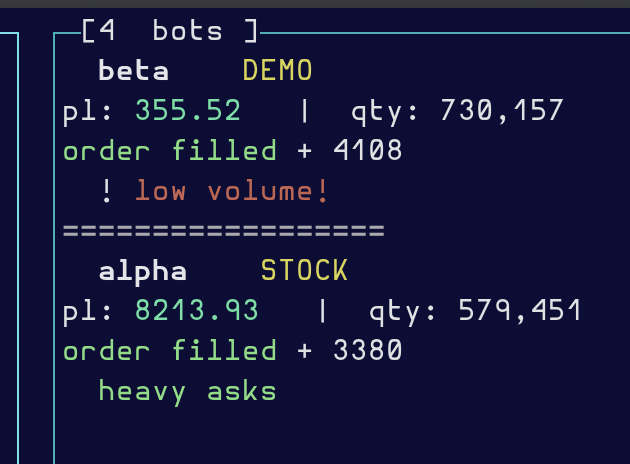

# bots

## introduction

Bots in iexcli are async nodejs functions that accept a few workspace related
params and optionally return an interval that can be started and stopped from
the command line in iexcli. All functions must be exported from the file found
at the root level of this repository named `bots.js`. See demo bots at
`bots.js` and `docs/bots/alpha.js`. The parameters passed down to the bot on
instantiation include two printing functions that are the primary ways your
bot communicates with the interface.



Currently all bots' runtimes will be constrained by iexcli's, which means that
bots started through the iexcli app will not continue running if iexcli shuts
down for any reason. So it is not recommended to use longer term bots with
iexcli at the moment, but rather only ones that can be started and stopped
without too much overhead.

For instance, if a bot calls up GBs of data to analyze before it starts
trading and is expected to run for days, this would not be a great tool to
manage that, as it is still too unstable. Rather this might be a good way to
quickly develop algorithms against live market data, and have a strong visual
indication of what different bots are doing under different market situations.

## usage

Export your functions from `bots.js` in the top-level directory of this repo.

If you have exported your functions correctly, they should be listed when you
type `bots ls` in the repl. Type `bots start {yourbotname}`, as displayed in
the `bots ls` command, to start your bot. Type `bots stop {yourbotname}` to
halt the bot.

Bot functions are supplied two parameters: `ws` and `options`. There is a
`print(botInfo)` method on the options object you can use to update the bots
component if one is available. You can also use `ws.printLines(lines)` to
print to the repl output.

`ws`, workspace, should be treated as read-only. Its `printLines()` method
accepts either an array of strings or a string, single line or multi-line is
fine. The function prints to the repl output if one is available.

The options object has the following shape, and should be treated as
read-only:

```json
{
  symbol: 'symbol value',
  time: 'parsed time value',
  print: print(botInfo),
}
```
ex
```javascript
async function meanRev(ws, options){
  const interval = setInterval(()=>{
  // 1) get data
  // 2) make a trading decision
  // 3) make trade
  // 4) print message
  options.print({
    bot: 'meanRev',
    symbol: options.symbol,
    pl: 123,
    qty: 100,
    msg: `the message you wish to be displayed below the bots\' listing.
Use {red-fg}ansi{/} {#00f-fg}escape codes{/} to color your own output`
  })
  // sleep for 1000 ms and run this again
  }, 1000)

  // return the interval to allow iexcli to start and clear it from the repl
  return interval
}
```

`options.print(botInfo)` is a special printer for the `bots` component. It takes
one parameter, `botInfo`, that has the following shape:

```javascript
const botInfo ={
  bot: 'the name of the bot. Must match the function name!',
  symbol: 'the stock your bot is trading',
  pl: 'profit/loss',
  qty: 'size of position',
  msg: 'the message you wish to be displayed below the bots\' listing'
}
```
The function will format this in a convenient way for the bot component and
print it there with along with all the other bot info.


`options.print(botInfo)`

## development

 Work is in development on a socket based interface to allow independent bot
 runtimes that can be monitored from the iexcli interface.

